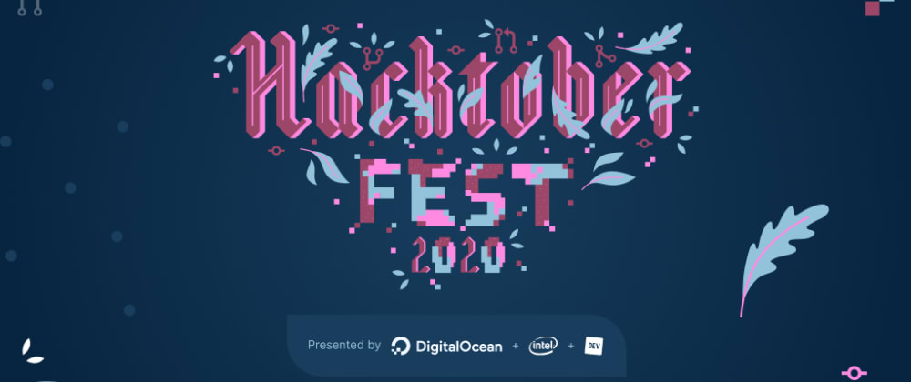

# hacktoberfest-beginners-guide

This repo contains probably all the minor and major point a beginner should know before starting up the contribution into hacktoberfest 2020

- Firstly login to your [_Github_](https://github.com/) account and if you're new to it then create one.

- After that go to [\*Hacktoberfest](https://hacktoberfest.digitalocean.com/) and read all the details from the [Resources\*](https://hacktoberfest.digitalocean.com/details) section about how to participate in Hacktoberfest

- You need to create at least _4 pull_ request in any GitHub hosted repository, and you're all set for good!

- When you're done reading the details, go ahead and signup by clicking up the [_START HACKING_](https://hacktoberfest.digitalocean.com/login) and connect your GitHub account to Hacktoberfest.

- Once done, you would be able to see your pull request counts into the _Profile_ section.

- Now go ahead and start searching for an open-source project that you would like to contribute. Also, make sure the project you're going to contribute with has a contributing file. Inside the _contributing.md_ file you'll find all the details on how you can contribute to the project. (some projects have this file, others don't)

### Now after getting a bit of idea you must be thinking...

### "How do I choose what to work on?"

So... it's all depends on your interest!
One of the best ways to get involved in open source is to start with a minor issue, to learn the flow. Then, consider making an improvement to something you regularly use; like an extra feature, test, or a fix to an API documentation.

After selecting the repository you want to work on, the first thing you need to do is to click the fork button

- 

      

      
  After selecting the repository you want to work on, the first thing you need to do is to click the <b>Fork</b> button
      
 
      

      
  

  

<!--  -->

Fork creates a copy of the repository into your GitHub account and once done with it you can clone or download the repository.

- 

      

      
  Click on code and copy the link and clone the repository in your local device by using the terminal:   <code>git clone (repository link) </code> and you'll get the cloned repo in your device and fix the issues.
      
 
      

      
  

  

Once done with fixing the issues,

- Open the terminal and add the changes to the github repository by using command:

  <code>git add .</code>

- Also, add the message related to the issues you've fixed.

  <code>git commit -m ("your message")</code>

- And push your code by using <code>git push</code>

- 

      

      
 To check or confirm you can look over once to your github repository, there you would be able to see all the commits you've made so far and a "Pull request" option. Click on it, and you must be able to see the comparision of master branches of yours and the repository's owner.
      
 
      

      
 
      

  

- 

     

     
 Now create the pull request by clicking up "Create pull request". Write a clear and concise subject and description for your change as the owner of the repository will get the idea of the changes you've made and to decide whether to accept your change.
     
 
     

     

    
     

  

Give it a final review to your changes and when you are done then click the "Create pull request" button.

Now if you go back to your [_Hacktoberfest_](https://hacktoberfest.digitalocean.com/) profile, you will get to see your progress.

Make sure you do at least five pull requests this month..... 🎉 
